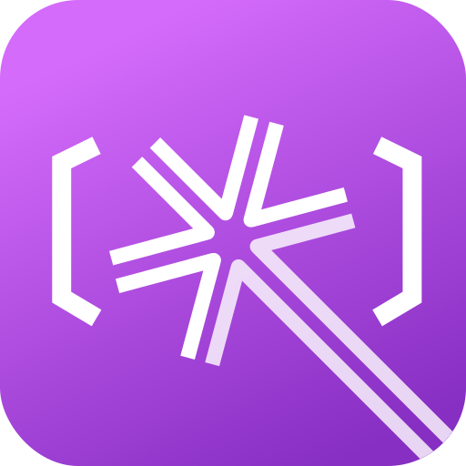

  
  <h1>Repo Wizard</h1>

  

 

[Read in Chinese (中文)](./docs/README.zh-CN.md)

> [!NOTE]
> This project is under active development. Issues and PRs are welcome!

---

Repo Wizard is a **code refactoring staging area** designed for developers. It addresses a key pain point: how to **safely, efficiently, and reviewably** apply complex, multi-file code changes suggested by Large Language Models (like GPT-4, Claude, etc.) to a local codebase.

### Core Workflow

1.  **Load Project**: Open your local code project in Repo Wizard.
2.  **Build Context**: Browse the file tree, check one or more files to include as context, and write clear refactoring instructions.
3.  **Generate Prompt**: The application intelligently combines your instructions and the selected file contents into an optimized prompt, ready to be copied to an LLM.
4.  **Get AI Suggestions**: Paste the prompt into your preferred LLM service and copy the complete Markdown response back.
5.  **Review Changes**: Repo Wizard parses `diff` blocks from the Markdown to create an interactive "Change Review" view. Here, you can:
    -   See a clear list of all files affected by the changes.
    -   Inspect each file in a side-by-side diff view to see precise additions, deletions, and modifications.
    -   Individually **approve** or **discard** changes for each file.
6.  **Apply with One Click**: After your review, apply all **approved** changes to your local filesystem atomically. A backup is automatically created for easy restoration.

### Design Principles

-   **Safety First**: No files are modified on disk without explicit user review and approval. Backups are automatically created before applying changes and can be restored from the history panel at any time.
-   **Streamlined Workflow**: Focused on making the core workflow as smooth and frictionless as possible, reducing the cognitive load of switching between tools.
-   **Modularity & Extensibility**: Every part of the application (UI, state management, filesystem, diff parsing) is designed as a highly decoupled module.

### Tech Stack

-   **Core**: Rust, Tauri
-   **Frontend**: React, TypeScript, Vite
-   **State Management**: Zustand
-   **UI**: TailwindCSS, Lucide Icons, React Resizable Panels
-   **Code/Diff Viewer**: Monaco Editor

### Contributing

Contributions of all kinds are welcome! Please check out our [**Contributing Guide (CONTRIBUTING.md)**](./CONTRIBUTING.md) to get started.