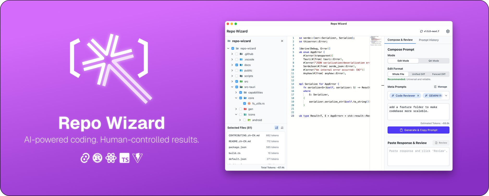
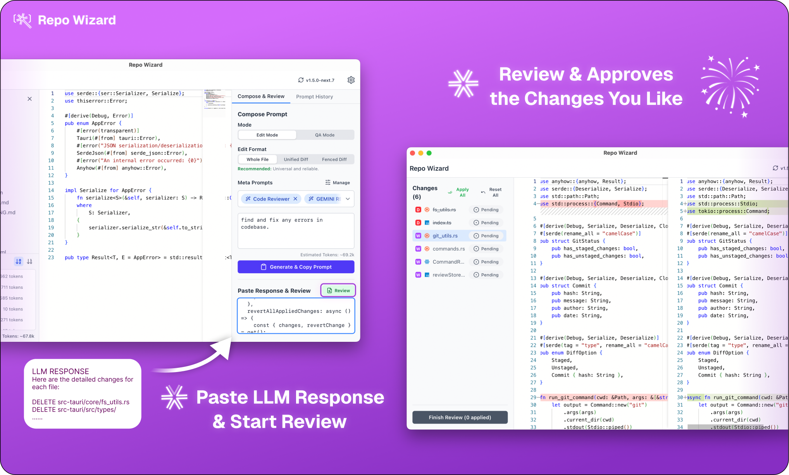

  
  <h1>Repo Wizard</h1>

  

 

[Read in Chinese (中文)](./docs/README.zh-CN.md)

> [!NOTE]
> This project is under active development. Issues and PRs are welcome!

---

Tired of the tedious copy-paste dance when applying LLM-suggested code changes? Repo Wizard is your **code refactoring staging area**, designed to bridge the gap between AI suggestions and your local codebase safely and efficiently.

It helps you apply complex, multi-file code changes suggested by Large Language Models (like GPT-4, Claude, Gemini, etc.) with full control and reviewability.

## Why Repo Wizard? The Human-in-the-Loop Philosophy

Unlike fully autonomous AI agents that can feel like a black box, Repo Wizard puts you firmly in the driver's seat. It embraces a **human-in-the-loop** philosophy where control belongs to the user, not the AI.

-   **Full Control**: You decide which files provide context. You write the instructions. You review every single change.
-   **Deep Understanding**: The side-by-side diff view ensures you understand the implications of every line of code before it's applied. No surprises.
-   **Unparalleled Efficiency**: Instead of applying one change at a time, Repo Wizard lets you send multiple change requests to the LLM at once. You can issue the same prompt multiple times to quickly compare results, or request several different modifications simultaneously. No more waiting for an agent to apply changes one-by-one, only to start over when you find a problem.

## Quick Start & Core Workflow

Here’s how you can go from an idea to committed code in minutes.

**1. Load Project & Build Context**
Open your local project. The file tree appears instantly. Select the files you want to include as context in prompt.

  

**2. Write Instructions & Generate Prompt**
In the "Compose" panel, write your detailed instructions. Repo Wizard combines your instructions, selected file contents, and any "meta-prompts" (like file trees or formatting rules) into a single, optimized prompt. Click "Generate & Copy Prompt".

  

**3. Get AI Suggestions**
Paste the generated prompt into your favorite LLM (see our [recommendations](#tips-for-best-results) below). Copy the full Markdown response from the model.

**4. Paste, Review, and Apply**
Paste the response back into Repo Wizard. It automatically parses the response and presents a list of proposed changes.
- Inspect each change in a side-by-side diff view.
- Approve the changes you like and reject the ones you don't.
- When you're satisfied, click "Finish Review" to apply all approved changes to your local files atomically.

  

## Tips for Best Results

The quality of the output depends heavily on the model you use. Here are some recommendations based on our experience:

-   **Highly Recommended: Gemini 2.5 Pro**. When used via [Google AI Studio](https://aistudio.google.com/) with the "Thinking Budget" set to maximum, it has shown exceptional results, especially for large repositories and complex, multi-file changes.
-   **Multi-Model Strategy**: Since Repo Wizard is model-agnostic, you can send the same prompt to multiple models (e.g., Gemini, Claude, ChatGPT) and paste each response back. The app will create separate review sessions, allowing you to compare their suggestions side-by-side and pick the best one.
-   **Browser Power-Up**: For an even better multi-model workflow, use a browser that supports split-screen views (like Arc or Zen) or pair your browser with a tiling window manager. This lets you see multiple LLMs side-by-side in the same tab, making it easy to send the prompt to all of them at once.

## A Note from the Developer

Repo Wizard was born out of a personal need and developed at a rapid pace, with a healthy dose of AI assistance in writing the code itself. This means a few things:

-   **Platform Stability**: I developed this primarily on macOS. While it has been tested on Windows, you may encounter more bugs on Windows or Linux. If you do, please **open an issue**! I'm committed to fixing them as quickly as possible.
-   **Help is Welcome**: This is largely a one-person effort. If you're excited about the project, please consider contributing! Check out our [contributing guide](./CONTRIBUTING.md).

> [!WARNING]
> **Please, please, please back up your code!**
> Use Git or simply copy your project to a safe place before using Repo Wizard extensively. While I've never experienced it corrupting a codebase, who knows when a weird bug might happen. Your code is precious—protect it.

## Tech Stack

-   **Core**: Rust, Tauri
-   **Frontend**: React, TypeScript, Vite
-   **State Management**: Zustand
-   **UI**: TailwindCSS, Lucide Icons, React Resizable Panels
-   **Code/Diff Viewer**: Monaco Editor