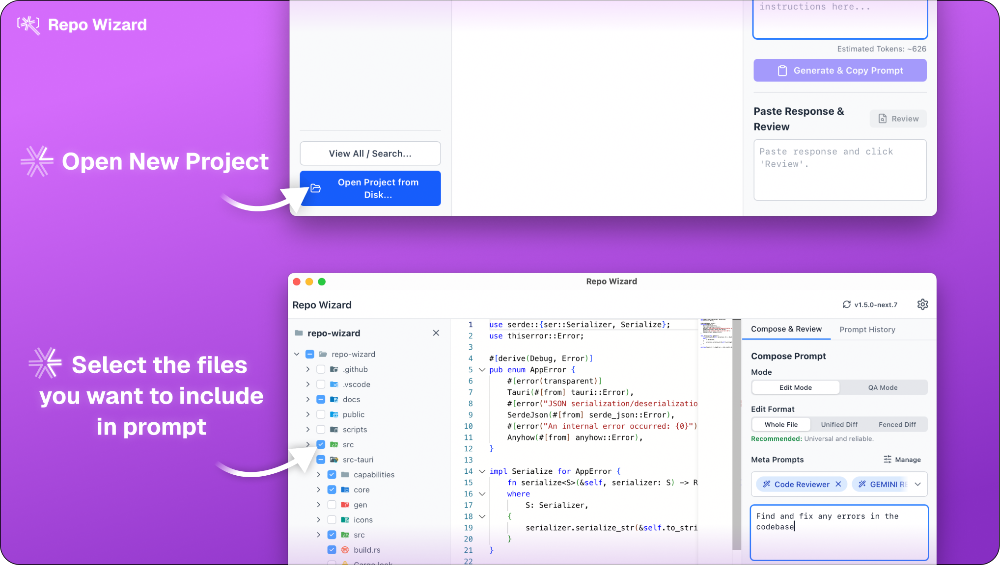

[Read in English](../README.md)

  
  <h1>Repo Wizard (代码巫师)</h1>

  

 

> [!NOTE]
> 本项目正在活跃开发中，欢迎提交 Issue 和 Pull Request！

---

厌倦了在应用大语言模型（LLM）建议的代码变更时，那种繁琐、枯燥的复制粘贴？Repo Wizard 就是你的**代码重构暂存区**，旨在安全、高效地填补 AI 建议与本地代码库之间的鸿沟。

它能助你将大语言模型（如 GPT-4, Claude, Gemini 等）建议的复杂、跨文件的代码变更，以完全可控、可审查的方式应用到项目中。

## 为什么选择 Repo Wizard？“人在回路”的哲学

与那些如同黑盒的全自动 AI 代理不同，Repo Wizard 将控制权牢牢交还给你。Repo Wizard 信奉 Human-in-the-Loop的哲学，掌控权应该交给用户而不是 AI。

-   **完全控制**：你来决定哪些文件提供上下文，你来撰写指令，你也来审查每一处变更。
-   **深度理解**：Side-by-side 的对比视图确保你能清晰理解每一行改动带来的影响。
-   **超高效率**：跟一次只能应用一种修改对比，Repo Wizard 可以帮你向语言模型一次发送多个更改。你可以发出多条相同的提示，快速生成应用对比结果，又或者同时进行多种不同的修改。而不是干等agent生成一个又一个更改，发现问题就只能从头再来。

## 快速上手与核心工作流

只需几分钟，你就能将一个想法变成实际提交的代码。

**1. 加载项目 & 构建上下文**
打开你的本地项目，文件树会立即呈现。勾选你希望作为上下文提供的文件。

  

**2. 撰写指令 & 生成提示**
在“编排”面板中，撰写详细的指令。Repo Wizard 会将你的指令、所选文件的内容以及任何“元提示”（如文件树、格式化规则）组合成一个优化过的、单一的提示。点击“生成并复制提示”。

  

**3. 获取 AI 建议**
将生成的提示粘贴到你喜欢的 LLM 中（请参考下方的[模型建议](#获得最佳结果的技巧)）。然后，复制模型返回的完整 Markdown 响应。

**4. 粘贴、审查与应用**
将响应粘贴回 Repo Wizard。它会自动解析响应内容，并生成一个待处理的变更列表。
- 在并排差异视图中检查每一处变更。
- 批准你喜欢的变更，拒绝不想要的。
- 当你满意后，点击“完成审查”，所有已批准的变更就会被原子化地应用到你的本地文件中。

  

## 获得最佳结果的技巧

输出质量在很大程度上取决于你使用的模型。以下是我们根据经验得出的一些建议：

-   **强烈推荐：Gemini 2.5 Pro**。通过 [Google AI Studio](https://aistudio.google.com/) 使用，并将“思考预算”设置为最大时，它的表现非常出色，尤其擅长处理大型代码库和复杂的多文件变更。
-   **多模型策略**：由于 Repo Wizard 与模型无关，你可以将同一个提示发送给多个模型（例如 Gemini, Claude, GPT-4），然后将每个模型的响应都粘贴回来。应用会为每个响应创建独立的审查会话，让你能轻松对比它们的方案，并选择最佳的一个。
-   **浏览器加成**: 为了获得更好的多模型工作流，可以考虑使用支持分屏视图的浏览器（如 Arc和Zen）或搭配平铺式窗口管理器。这能让在同一个标签页中并排查看多个 LLM，从而轻松地将提示一次性发送给所有模型。

## 来自开发者的一些话

Repo Wizard 的诞生源于我个人的需求，并在一个相当快的节奏下开发完成，其中也大量借助了 AI 辅助编码。这意味着：

-   **平台稳定性**：我主要在 macOS 上开发。虽然它也在 Windows 上进行过测试，但你在 Windows 或 Linux 上使用时可能会遇到更多未预料的 Bug。如果遇到问题，请务必**提交一个 Issue**！我会尽快修复它们。
-   **欢迎帮助**：这基本上是一个单人项目。如果你对这个项目感到兴奋，请考虑做出贡献！请查阅我们的[贡献指南](../CONTRIBUTING.md)。

> [!WARNING]
> **请务必、一定、千万要备份你的代码！**
> 在深入使用 Repo Wizard 之前，请使用 Git 或直接复制你的项目到一个安全的地方。虽然我没遇到过它搞砸代码库的情况，但谁也无法预料奇怪的 Bug 何时出现。你的代码非常宝贵——请保护好它。

## 技术栈

-   **核心**: Rust, Tauri
-   **前端**: React, TypeScript, Vite
-   **状态管理**: Zustand
-   **UI**: TailwindCSS, Lucide Icons, React Resizable Panels
-   **代码/Diff查看器**: Monaco Editor